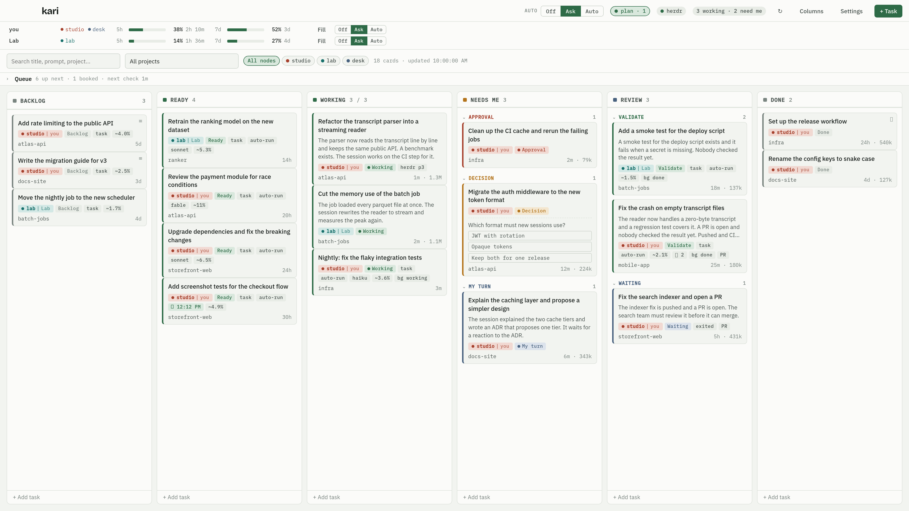

# kari

<p align="center">
  <picture>
    <source media="(prefers-color-scheme: dark)" srcset="docs/screenshots/board-dark.png">
    
  </picture>
</p>

kari (Estonian: herd) is a macOS tray app that shows every Claude Code session as a card on a Kanban board. The board updates itself from local Claude Code state. Backlog tasks can start as background sessions when quota is left over.

kari works with the tools you already use. It reads what Claude Code writes to disk and never writes there. When [herdr](https://github.com/herdrdev/herdr) runs, kari maps sessions to herdr panes and can open new sessions in them.

The screenshot above shows the current release with a demo board. `TOUR.md` walks through every view. Design: see `DESIGN.md`.

## Install

1. Download the `.dmg` for your Mac from the [latest release](https://github.com/lightheaded/kari/releases/latest): `aarch64` for Apple silicon, `x64` for Intel.
2. Open the image and drag kari to Applications.
3. The app is not signed. macOS will refuse to open it until you remove the quarantine flag:

```
xattr -dr com.apple.quarantine /Applications/kari.app
```

4. Start kari. It appears in the menu bar and reads your Claude Code state.
5. Optional: run `scripts/install-statusline.sh` for quota meters, and click "Install hooks" in Settings for live state. Both are described below.

## What works

- Cards appear for every session with a transcript in the history window, and for every live process.
- State comes from the live session registry, transcripts, background jobs and herdr. Columns accept sets of states and are configurable.
- Manual moves hold until a stronger signal arrives. Decision and approval signals always win.
- Jump in focuses the herdr pane, or opens a terminal window with `claude --resume`. iTerm2, Terminal and Ghostty are supported.
- Backlog tasks can start as `claude --bg` jobs from the card drawer.
- Quota meters read `rate_limits` from the Claude Code status line through a wrapper.
- Live hooks: Claude Code posts session events to kari on `127.0.0.1:47311`. A permission prompt moves the card to Approval needed within a second.
- Summaries: Haiku writes a two-sentence narrative per session after a turn ends. Calls are capped per hour.
- Estimates: kari learns how much of the 5-hour window one million weighted tokens costs, then gives each card a cost estimate with a band.
- Proposals: when quota would expire unused, kari offers a plan. Start, Start all, Snooze or Dismiss.
- Model per card: a task can name the model it runs with, for example Fable for a deep review and Sonnet for operational work.
- Run log and kill switch: every background job kari starts writes a state history on its card. The tray stops all jobs after a confirm click.
- Autopilot (off by default): a weekly-reset plan can start by itself, with a notice and a Stop button.

Not yet built: multi-machine merge.

## Requirements

- macOS 12 or later, Claude Code 2.1 or later, `jq`.
- Optional: herdr 0.8 or later for pane mapping.
- To build from source: Rust toolchain (`rustup`), Bun.

## Build from source

```
bun install
bun tauri dev
```

Build a bundle:

```
bun tauri build
```

## Quota tracking

The status line wrapper saves the rate-limit windows on every refresh:

```
scripts/install-statusline.sh
```

The script backs up `~/.claude/settings.json`, stores the original command in `~/.config/kari/statusline.original`, and writes samples to `~/.config/kari/rate-limits.json`. Run the script with `--uninstall` to restore the original command. New Claude Code sessions pick up the wrapper. Running sessions keep the old command until they restart.

## Live hooks

Open Settings and click "Install hooks". kari writes a relay script to `~/.config/kari/hook.sh` and registers it in `~/.claude/settings.json` for these events: SessionStart, SessionEnd, UserPromptSubmit, Stop, Notification, PreToolUse (AskUserQuestion and ExitPlanMode), PostToolUse. kari keeps a backup of the settings file in `~/.config/kari/`. The relay posts the payload with `curl` and always exits 0, so a closed kari never blocks a session. Every post carries a token from `~/.config/kari/hook-token` in the `x-kari-token` header. kari creates the token on first start with mode 0600 and refuses a post without it. A process that runs as your user can read the file, so the token keeps out other users, sandboxed apps and web pages, not your own processes. New sessions pick up the hooks. Running sessions keep the old settings until they restart. "Remove hooks" takes the entries out again and leaves other hooks in place.

The receiver also serves `GET /kari/board` (the board as JSON) and `GET /kari/health` for scripts. The board needs the same token:

```
curl -H "x-kari-token: $(cat ~/.config/kari/hook-token)" 127.0.0.1:47311/kari/board
```

## Summaries

After a turn ends, kari runs `claude -p --model haiku` with the last 30 messages of the transcript and stores the result: narrative, open questions, next step, judged state, confidence. The call uses `--no-session-persistence`, no tools, no MCP servers and no settings, so it runs no hooks and leaves no transcript. A confident judgment can move a quiet session to Waiting on others or Validate. It never overrides a hard signal such as a pending question or a busy process. Limits live in Settings: on or off, model, calls per hour (default 6), and the recent window (default 48 hours). "Summarize" in the card drawer makes one call outside the cap.

## Estimates and calibration

Rate limits are percentages. Transcripts are tokens. kari pairs the points where the reported 5-hour percent changed with the token growth it saw between them, then keeps the median. Five clean pairs replace the prior. The learned factor and the band appear in the quota bar tooltip.

A task card estimate is the median weighted-token cost of past sessions in the same project, else the global median. A session card estimate is the cost of eight more turns at that session's own rate. Set `estimate_weighted_tokens` on a card to override it.

Weighted tokens count output five times, cache writes 1.25 times and cache reads a tenth, so the number tracks cost, not volume.

If no session refreshes the status line for 5 minutes, kari can ask the undocumented OAuth usage endpoint instead. That fallback is off by default. It reads the Claude Code login token from the keychain, asks at most once every 3 minutes with a `kari/<version>` user agent, and never writes the token to a log.

## Proposals

kari offers a plan when one of three things happens:

1. The 7-day window holds more than 40 percent unused and resets within 36 hours.
2. The 5-hour window is below 30 percent and nobody worked for 45 minutes.
3. You press "Fill the quota" in the quota bar.

The planner ranks cards by priority, then by age. It only takes cards marked "May run unattended" that carry a prompt and a project directory. It never takes a card that is working, or one that waits for you. It packs the plan into the free part of the 5-hour window, keeps 30 percent free between 08:00 and 20:00, never fills past 85 percent, and holds the parallel cap of two jobs.

The panel shows the reason, the budget, the plan total and the window after the run. Buttons: Start, Start all, Snooze 1 hour, Dismiss. Dismiss keeps the same trigger quiet until its window moves on. Every threshold is in Settings.

## Runs, run log and the kill switch

A started card runs as `claude --bg` with the permission mode of the card, or the default from Settings. New installs default to `auto`. Choose `bypassPermissions` there only if you accept that an unattended run has no permission checks in the project directory.

Each card can also name a model. The New task dialog and the card drawer offer Fable, Opus, Sonnet and Haiku, and "Default" leaves the choice to Claude Code. kari passes the name as `--model` on every start: background runs, Jump in, and a herdr pane. Settings holds the default for cards that name none. A card that names a model shows it as a chip, and the plan panel shows it per task. kari follows the job and writes one run-log line per state change. The card drawer shows the log. The job outcome stays on the card after `claude agents` forgets the job, so a finished job leaves the card in Validate and a failed job leaves it in My turn.

Stop one job from the card drawer. Stop everything from the tray: the first click arms the item, the second click within 10 seconds stops the jobs. The tray tooltip shows how many sessions work and how many need you.

## Autopilot

Autopilot is off by default. When it is on, a plan from the weekly-reset trigger starts without a click, up to the autopilot job cap. kari still sends a notice, and the plan panel keeps "Stop these jobs" as the undo. The idle trigger and the manual button always wait for a click.

## herdr as a launch target

When herdr runs and "Open new sessions in a herdr pane" is on, Jump in creates a herdr tab in the project directory and starts Claude Code in its pane, with `--resume` for a session card. If herdr refuses, kari falls back to the terminal. An existing pane is always focused instead.

## Data

- Database: `~/.config/kari/kari.db` (SQLite).
- kari reads `~/.claude/sessions`, `~/.claude/projects`, `~/.claude/jobs` and the herdr socket. It never writes to those directories. The hook and status line installers edit `~/.claude/settings.json` only when you ask, and keep a backup.

## Layout

```
crates/kari-core   readers, parser, inference, store, launcher
src-tauri          Tauri shell: commands, events, tray, notifications
src                React UI
scripts            status line installer, version bump, demo board, screenshots
docs/demo          the dummy board behind the screenshots
docs/screenshots   the images in this README and in TOUR.md, retaken for each release
```

Smoke test the core against local data without the UI:

```
cargo run -p kari-core --example board        # the board as text
cargo run -p kari-core --example board -- --json > fixtures/board.json   # snapshot for `bun run dev` in a browser
cargo run -p kari-core --example estimates    # calibration and per-card estimates
cargo run -p kari-core --example plan -- /tmp # build a plan from temporary cards
cargo run -p kari-core --example jobrun -- /tmp   # start one background job and follow it
cargo run -p kari-core --example herdr_open -- /tmp   # open and close a herdr pane
```

The `plan`, `jobrun` and `herdr_open` examples create temporary cards, tabs or jobs and clean up after themselves. Give them a scratch directory, never a real project.

`bun run demo` opens the UI in a browser with the dummy board from `docs/demo`. No Rust toolchain and no Claude Code state are needed for that.

## Contributing

See `CONTRIBUTING.md`. Issues that describe a real session and what you expected are the most useful input.

## License

Apache License 2.0. See `LICENSE`.
