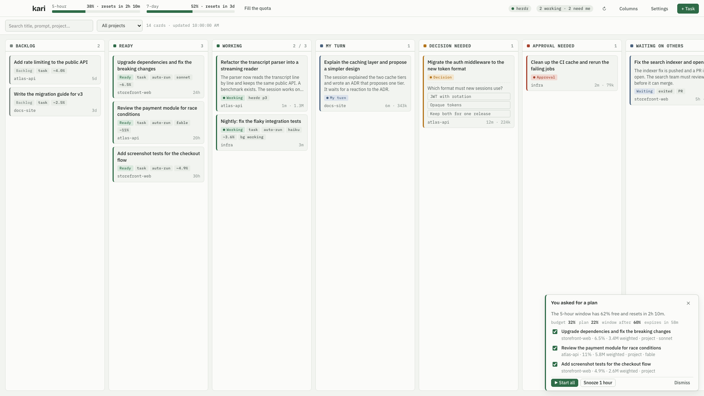
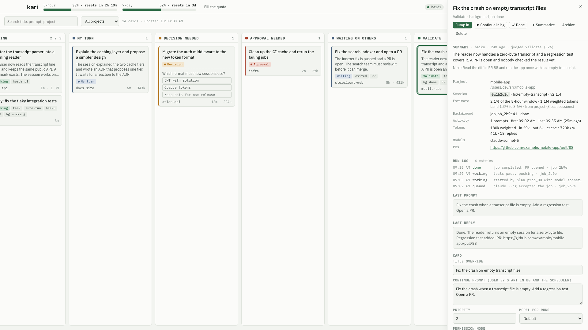
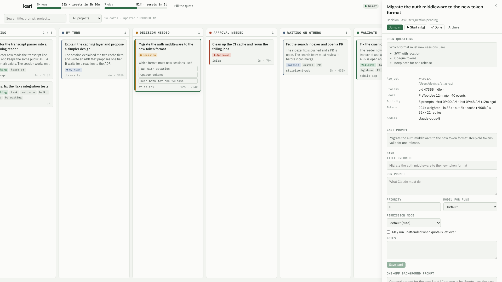
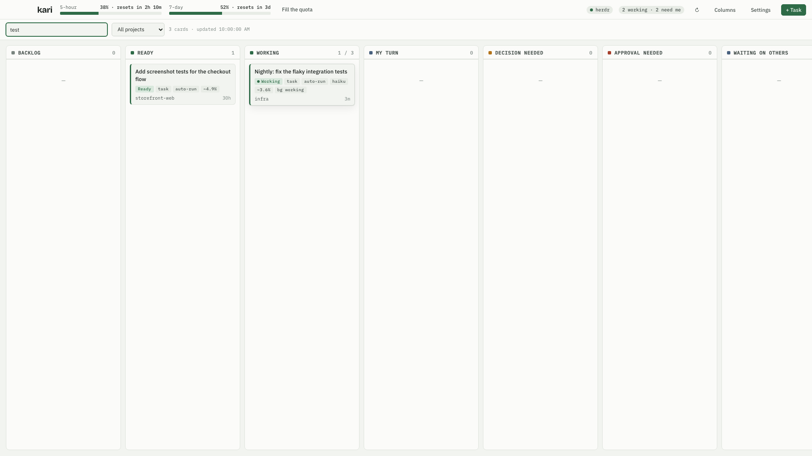
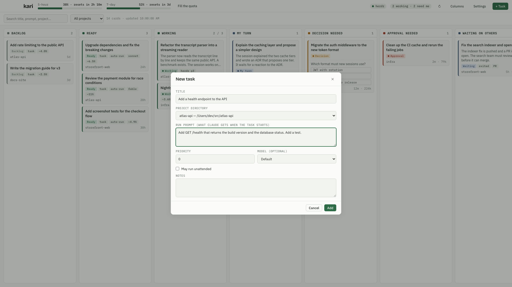
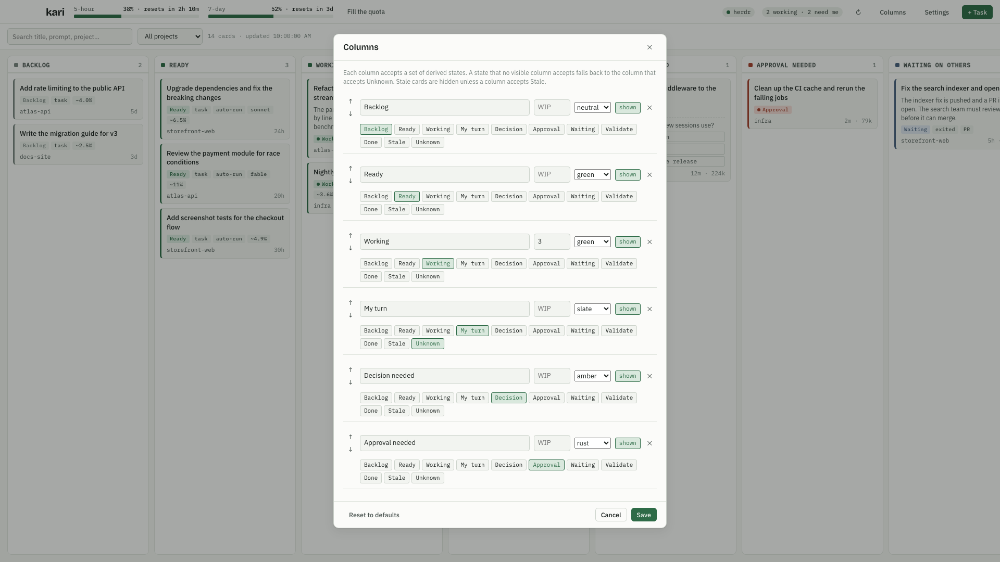
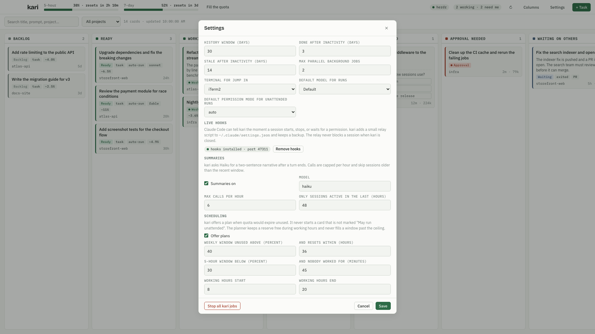

# A tour of kari

This page shows every view of kari with a demo board. The images come from `bun run screenshots` and match the current release. Every project, session and prompt in them is invented.

The README explains how kari reads its data and how to install it. This page explains what you see.

## The board


The window has three bands.

1. The top bar: the quota meters, "Fill the quota", the herdr indicator, a counter of sessions that work and sessions that need you, and the buttons for Columns, Settings and a new task.
2. The filter bar: a search field, a project filter, and the card count with the time of the last scan.
3. The columns. Each column accepts a set of derived states. The number in the header is the card count, or the count against the WIP limit.

Columns are 272 pixels wide. A window shows as many as fit, and the board scrolls sideways for the rest.

### Cards

A card carries what you need to decide whether to open it.

- The title. kari takes the custom title, else the AI title, else the first prompt.
- A summary from Haiku when one exists, in two sentences.
- Chips: the derived state, `task` for a card without a session, `exited` for a session without a process, `auto-run` for a task that may run unattended, the model, an estimate in percent of the 5-hour window, `bg working` or `bg done` for a background job, and the herdr pane.
- An open question with its options, when the session waits for an answer.
- The project name, the time since the last activity, and the weighted token count.

Colors follow the state. Green means that work happens or is ready. Slate means that the session waits for you or for others. Amber means that a decision is due. Rust means that a permission prompt blocks the session.

Click a card to open the drawer. Double-click a card to jump into the session. Drag a card to another column to place it by hand. A manual placement holds until a stronger signal arrives, and the card shows a small lock mark.

## The plan panel



kari offers a plan when quota would expire unused, or when you press "Fill the quota". The panel says why, how much of the 5-hour window the plan may spend, what the picked tasks cost together, and where the window will be after the run.

Each line is one Ready card with its project, its estimate and its model. Untick a task to leave it out. "Start all" or "Start N" starts the picked tasks as `claude --bg` jobs. "Snooze 1 hour" hides the panel for an hour. "Dismiss" keeps the same trigger quiet until its window moves on.

After a start, the panel lists the started jobs and offers "Stop these jobs".

## The card drawer



The drawer shows one card in full.

- The header: the title, the state with the reason kari chose it, and the actions. "Jump in" opens the session. "Start in bg" or "Continue in bg" starts a background job. "Done" moves the card to the Done column. "Summarize" asks Haiku for a fresh summary now. "Archive" hides the card. A task card also has "Delete".
- Summary: the narrative, the next step, and the judged state with its confidence.
- Facts: project and directory, session id with branch and Claude Code version, process, herdr pane, hook state, estimate with its band and source, background job, activity, tokens, models, and PR links.
- Run log: one line per state change of every background job that kari started for this card.
- Last prompt, last reply and first prompt from the transcript.
- The card fields: title override, run prompt or continue prompt, priority, model, permission mode, "May run unattended", and notes. "Save card" writes them.
- A one-off prompt for the next background start.

The drawer in the image belongs to a task that ran as a background job. The job finished, opened a PR, and left the card in Validate.

## A decision



When Claude Code calls `AskUserQuestion`, the card moves to Decision needed within a second and shows the question with its options. The drawer lists every open question. "Jump in" takes you to the terminal to answer.

An approval works the same way. A permission prompt moves the card to Approval needed. The drawer shows the tool call that waits.

## Search and filter



The search field matches the title, the project name, the last prompt and the state reason. The project filter narrows the board to one directory. Both work together. The card count in the filter bar follows the filter.

## New task



A task is a card without a session. Give it a title and a project directory. The run prompt is what Claude Code gets when the task starts. An empty prompt uses the title. Set a priority, pick a model, and tick "May run unattended" when the planner may start it. The card appears in Backlog, or in Ready when it may run unattended and has a prompt.

## Columns



Every column has a name, a WIP limit, a color, and the set of states it accepts. Move columns with the arrows. Hide a column to keep its mapping without a place on the board. Merge states into one column, for example Decision and Approval into "Needs me". A state that no visible column accepts lands in the column that accepts Unknown. "Reset to defaults" restores the nine default columns.

## Settings



Settings holds every threshold and switch.

- History and inactivity windows, the parallel job cap, the terminal for Jump in, and the default model and permission mode for unattended runs.
- Live hooks: install or remove the Claude Code hooks that post session events to kari.
- Summaries: on or off, model, calls per hour, and the recent window.
- Scheduling: the two automatic triggers, the working hours, the reserve and the ceiling.
- Autopilot: start weekly-reset plans without a click, the autopilot job cap, herdr as the launch target, and the weekly warning.
- Quota tracking: the status line installer and the optional usage endpoint fallback.

"Stop all kari jobs" stops every background job that kari started.

## The tray

kari lives in the menu bar. The tray tooltip shows how many sessions work and how many need you. The tray menu has "Open kari", "Refresh now", "Stop all kari jobs" and "Quit kari". "Stop all kari jobs" takes two clicks within 10 seconds, so one slip does not kill your work.

kari sends a macOS notification when a card needs you, when a plan is ready, when autopilot started a plan, when weekly quota is about to expire unused, and when a column passes its WIP limit. The same notice appears as a toast in the window. A click on the toast opens the card.

## Try the demo board

```
bun install
bun run demo
```

This opens the same dummy board in your browser. No Rust toolchain and no Claude Code state are needed. Actions that need the Tauri shell show an error toast in the browser.
