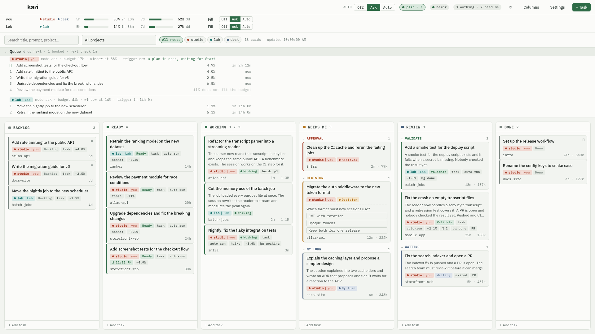

# A tour of kari

This page shows every view of kari with a demo board. The images come from `bun run screenshots` and match the current release. Every project, session and prompt in them is invented.

The README explains how kari reads its data and how to install it. This page explains what you see.

## The board


The window has four bands.

1. The top bar: the automation switch, the herdr indicator, a counter of sessions that work and sessions that need you, and the buttons for Columns, Settings and a new task.
2. The stats strip: one row per Claude Code account with both quota windows, both reset times, the machines that spend it, and "Fill". The windows belong to the login, so two machines on one account share a row. A click on the name gives the account one of your own, such as `tom` or `work`; the name stays on this device. Filtering the board is the job of the node chips below, which name one machine where a row here can cover several. The strip grows with the account count; the top bar never does.
3. The filter bar: a search field, a project filter that searches as you type, a chip per node, and the card count with the time of the last scan. Under it sits the queue strip.
4. The columns. Each column accepts a set of derived states. The number in the header is the card count, or the count against the WIP limit.

Six columns fit a 1440-pixel window with nothing to scroll. Two of them merge states: "Needs me" holds Approval, Decision and My turn, and "Review" holds Validate and Waiting on others. A merged column groups its cards by state inside itself, most urgent first, and a click on a group header collapses it.

Every column ends with "+ Add task", which opens a one-line draft in that column. A `#name` word in the draft picks the project.

When the board does scroll, three ways move it sideways: a trackpad or Shift with the wheel, a plain wheel over a column that cannot scroll further, and a drag on the ground between the columns.

### Cards

A card carries what you need to decide whether to open it.

- The title. kari takes the custom title, else the AI title, else the first prompt.
- A summary from Haiku when one exists, in two sentences.
- Chips: the derived state, `task` for a card without a session, `exited` for a session without a process, `auto-run` for a task that may run unattended, a clock with the time of a booked run, the model, an estimate in percent of the 5-hour window, a paperclip with the number of attached files, `bg working` or `bg done` for a background job, and the herdr pane.
- An open question with its options, when the session waits for an answer.
- The project name, the time since the last activity, and the weighted token count.

Colors follow the state. Green means that work happens or is ready. Slate means that the session waits for you or for others. Amber means that a decision is due. Rust means that a permission prompt blocks the session.

Click a card to open the drawer. Double-click a card to jump into the session. Click the node chip to filter the board to that node.

Drag a card to another column to place it by hand. A manual placement holds until a stronger signal arrives, and the card shows a small lock mark.

Drag a card inside its column to order it by hand. The drop places that card and everything above it, and the cards below keep the automatic order, so a card you never dragged never jumps. A placed card shows a `≡` mark and always sorts above the automatic ones. The planner reads the same order, so the top of a placed backlog is the first card a plan takes. Point at a column header to find "Automatic", which gives the whole column back to the automatic order.

## The queue



The strip under the filter bar is a dry run of the planner, with the booked runs in front of it. Collapsed, it says how many steps are up next, how many runs are booked, and when the planner looks again. Open, it lists one line per step: the rank, the card, the cost as a percent of the 5-hour window, and the start time. A booked run carries a clock in place of its rank. A step outside the budget says so and is dimmed. If nothing can run at all, the strip gives the reason.

The strip starts nothing. The plan panel keeps the buttons.

## The plan panel


kari offers a plan when quota expires unused, or when you press "Fill" on a quota row. The panel says why, how much of the 5-hour window the plan can spend, what the picked tasks cost together, and where the window stands after the run.

Each line is one Ready card with its project, its estimate and its model. Untick a task to leave it out. "Start all" or "Start N" starts the picked tasks as `claude --bg` jobs. "Snooze 1 hour" hides the panel for an hour. "Dismiss" keeps the same trigger quiet until its window moves on.

After a start, the panel lists the started jobs and offers "Stop these jobs".

## The card drawer


The drawer shows one card in full, and it is where you talk to the session.

- The header: the title, the state with the reason kari chose it, and the actions. Click the title to rename the card. "Jump in" opens the session. "Schedule" books a run for later. "Done" moves the card to the Done column. "Summarize" asks Haiku for a fresh summary now. "Archive" hides the card. A task card also has "Delete". A running job has "Stop job".
- Schedule: press it when the rate limit leaves no room now. The block offers the next reset of the 5-hour window, the cycle after that, the next reset of the weekly window, and a time you pick. Each button carries the time it would book. A booked card shows the time in the header and cancels from the same block. The booking ignores the automation mode, because you set the time.
- Where it stands: the summary's narrative, and a line that says how far the work travelled: committed, pushed, PR open, merged, released, deployed, CI passed or failed. Then the next step. A background job adds its own account: its state, what it waits for, and the reply it suggests. One tap puts that reply in the prompt box.
- Card: facts and fields in one list. Project, node, session, process, hooks, estimate, activity, tokens, models and PR links, then the fields you can change: priority, model, permission mode, MCP servers, "May run unattended", the scheduler prompt (or the body of a task), and notes. A field saves when you leave it. There is no Save button.
- Run log: one line per state change of every background job that kari started for this card, and one line per prompt sent from here.
- Conversation: the last prompt and the last reply. "Show all" lists every prompt and reply of the session, oldest first, with a search box. The button beside it opens the same conversation in a window of its own, with its own prompt box, so it can stay open while you work on the board.
- The prompt box at the foot. A running session takes the prompt into its own queue, so the terminal you look at answers it: an idle session at once, a busy one after its current turn. A session that is not running resumes as a background job with the prompt. A task starts as a background job. Cmd+Enter sends. The toast says whether the session took the prompt or holds it for the person at that terminal to release.
- Attachments, above the prompt box. Paste a screenshot into the box, or press "Attach" and pick a file. kari puts the file on the node that owns the card and names its path under every prompt, so the run reads it. A picture shows as a thumbnail. The ✕ on a chip removes that file. One file is at most 4 MB.

The drawer in the image belongs to a task that ran as a background job. The job finished, opened a PR, and left the card in Validate.

## A decision


When Claude Code calls `AskUserQuestion`, the card moves to Decision needed within a second and shows the question with its options. The drawer lists every open question. "Jump in" takes you to the terminal to answer.

An approval works the same way. A permission prompt moves the card to Approval needed. The drawer shows the tool call that waits.

## Search and filter


The search field matches the title, the project name, the last prompt and the state reason. The project filter narrows the board to one directory. Both work together. The card count in the filter bar follows the filter.

## New task


A task is a card without a session. Give it a title and a project directory. A run joins the title and the body with a blank line, so the title needs no repeating in the body. Pick a model and tick "May run unattended" when the planner may start it. The card appears in Backlog, or in Ready when it may run unattended.

"Attachments" takes a file for the new card. Paste a screenshot into the body, or press "Attach". The files stay in the dialog until you press Add, so a change of node costs nothing. kari writes them on the node the card lands on.

The foot of every column also holds "+ Add task". It opens a one-line draft in place: type the title and press Enter. "More" opens this dialog with what you typed. A draft added at the foot of Ready is marked "May run unattended" for you, and a draft added to any other column gets a manual lock on it.

A `#name` word in that line picks the project, so the draft needs no dialog. The name matches the project name or the last part of the path, and a few letters are enough: `#docs` finds `docs-site`. The line under the box names the project and the machine before you press Enter. On a board with more than one node, the tag picks the machine as well, because a path lives on one machine.

The tag is cut out of the title. Two rules keep the rest of your text. A word of digits alone, such as `#1234`, is an issue number and is never read as a tag. A word that matches no project also stays in the title, and the line says that nothing answered to it.

## Columns


Every column has a name, a WIP limit, a color, and the set of states it accepts. Move columns with the arrows. Hide a column to keep its mapping without a place on the board. A state that no visible column accepts lands in the column that accepts Unknown. "Reset to defaults" restores the six default columns.

The six defaults merge states, because nine columns do not fit one window. "Needs me" holds Approval, Decision, My turn and Unknown. "Review" holds Validate and Waiting on others. A column with more than one state groups its cards by state inside itself, most urgent first, and each group collapses. Split a merged column here whenever you want the states apart again.

## Settings


Settings holds every threshold and switch.

- History and inactivity windows, the parallel job cap, the terminal for Jump in, whether a run starts your MCP servers, and the default model and permission mode for unattended runs.
- Live hooks: install or remove the Claude Code hooks that post session events to kari.
- Summaries: on or off, model, calls per hour, and the recent window.
- Scheduling: the two automatic triggers, the working hours, the reserve and the ceiling.
- Autopilot: the job cap for mode Auto and the weekly warning. An autopilot run can open a pull request, and kari refuses a merge, a release or an image push in that run. The card names the command it tried.
- herdr: herdr as the launch target, and closing the tab of a card that is done or archived.
- Quota tracking: the status line installer and the optional usage endpoint fallback.
- Nodes: the name this machine shows to others, the list of remote nodes with their state, and the form that adds one.

"Stop all kari jobs" stops every background job that kari started, on every node.

## Nodes

A remote node is another host that runs `kari-node serve`. Add it in Settings with its SSH host. kari holds an SSH port forward to it and shows its cards on the same board.

- Every card carries a node badge, and a chip row above the board filters to one node.
- Quota meters are grouped by Claude Code account, not by node: two machines on one login draw down one window and share a row. A node whose account kari cannot read keeps a row of its own, so two budgets are never merged by guessing.
- An offline node keeps its cards on the board, dimmed, with the time it was last seen.
- You can still write to an offline node. A new task, an edit and a delete are kept and sent when the node answers. The card shows "waiting for node", and the node row counts what is waiting. Running, stopping and opening a session need the machine, so they come back with the forward.
- Jump in on a remote card opens your terminal and connects over SSH.

The README explains what a node needs.

The Nodes section also shows who pushes the columns. Two hubs, the desktop and the phone, can watch the same nodes, and only the primary one pushes. "Make this device primary" takes the lease on every online node. "Show pairing code" prints the code the phone reads. "Away mode on" makes a node hold permission prompts for a remote answer.

## The phone

The Android app is a second hub. It reaches the nodes over a private network, such as a VPN, and pairs with the code from the desktop. Four tabs:

- **Needs you**: the quota per account, the open plans with Start, Snooze and Dismiss, then every card that waits for a person. The actions sit on the card: an option of an open question, a reply, Allow and Deny for a held permission prompt, Stop, Done, Open.
- **Board**: one column at a time, and the first view is the Working column. A swipe, the arrows or the dots move between columns. A chip row filters to one node.
- **Add**: the task form. A task with a prompt and auto-run on is ready for the next plan.
- **Nodes**: the status and the lease holder per node, Away mode per node, "Make this device primary", the pairing code, and this device's name.

A tap on a card opens the same drawer as the desktop, without Jump in. The drawer shows the command to run in a terminal instead. The prompt box works the same way: a reply from the phone goes into the session that runs on the desk.

A phone sends over a link that drops. The box keeps your text until the send goes through, and an error toast says what went wrong. So a failed send costs one more tap and never the message. A send to a node that runs an older kari says so, and names the node to update.

## The tray

kari lives in the menu bar. The tray tooltip shows how many sessions work, how many need you, and how many nodes are offline. The tray menu has "Open kari", "Refresh now", "Stop all kari jobs" and "Quit kari". "Stop all kari jobs" takes two clicks within 10 seconds, so one slip does not kill your work.

kari sends a macOS notification when a card needs you, when a plan is ready, when mode Auto started a plan, when weekly quota is about to expire unused, and when a column passes its WIP limit. The same notice appears as a toast in the window. A click on the toast opens the card.

## Toasts and undo

Every command answers with a toast in the bottom left corner. A thin bar along the foot shows the time that is left. The stack holds while the pointer is on it, so you can read a long notice to the end. The close button drops one toast, and "Dismiss all" drops the whole stack.

A toast carries an Undo button when kari can reverse the action. A delete, an archive, a move to another column and a new task all have an undo. A save of a card, of the settings or of the columns has one too. So do the hooks switch and the automation switch. Undo puts the old state back, and the next toast says so. A deleted card comes back with its id, its times and its session, because kari sends the whole card to the node again.

## Try the demo board

```
bun install
bun run demo
```

This opens the same dummy board in your browser. No Rust toolchain and no Claude Code state are needed. Actions that need the Tauri shell show an error toast in the browser.
